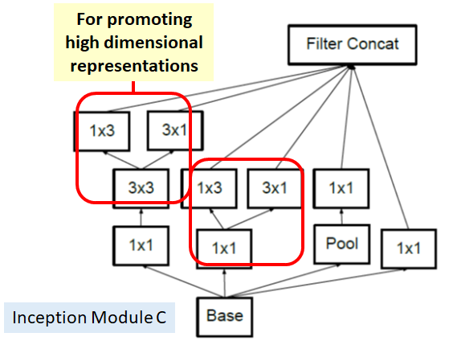

# Popular Neural Network Architectures
Hand implementation of some of the most important and groundbreaking neural network architectures.
This project was done as a way for me to get more familiar with the Keras Functonal API aswell as with different image processing techniques.

#Architectures
 - **[VGG16](#vgg16)**
 - **[ResNet50](#resnet50)**
 - **[Inception V3](#inception-v3)**
 
 ## VGG16
 
 
  The simplest of the implemented archictures and the only one who can be built with the Sequential API.
  
  It consists of blocks of convolutional layers followed by MaxPooling2D layers which then end in some Dense Layers.
  
  This is an extremely heavy architecture and, therefore, should not be used as a first resort.
  
  Further reading can be found **[here](https://neurohive.io/en/popular-networks/vgg16/)**
  
## ResNet50

The main characteristic of the ResNet architecture is the use of **skip connections**. These are connections where the output of a layer is added as input to a layer located a bit after.

There are two reasons to implement skip connections:
 - Solving the vanishing gradient problem.
 - They pass earlier information to later layers, helping in classification.

These connections are implemented in the ResNet50 via what's called a **Identity block**. This is a block composed by some convolution and pooling operations where a skip connection is present as a shortcut.

A slight variation of the identity block is the convolutional block where the shortcut path has a convlutional and a pooling layer. This layer is used to certify that the shape of the images in the main path is the same as the ones in the shortcut path.

The full architecture is presented in the following image:

  Further reading can be found **[here](https://towardsdatascience.com/understanding-and-coding-a-resnet-in-keras-446d7ff84d33)**

## Inception V3

The Inception V3 architecture is most notable for it's modules which implement techniques to reduce the number of parameters while not reducing the network's effectiveness.

The three modules are as follows :

  ##### Module A
  
  
  
  ##### Module B
  
  
  
  ##### Module C
  
  
 
  ##### Grid Size Reduction
  
  Besides the modules presented above, the Inception V3 also contains come grid size reduction modules.
  
  In other architectures, downsizing a feature map is either done by a Conv layer followed by a Max Pooling layer or a Max Pooling layer followed by a conv layer. This process either results in a loss of a lot of imformation or is too expensive.
  
  To solve this problem, Inception V3 implement a ** grid size reduction** technique. 
  
  Follwing this stategy, the feature maps either go through a conv layer or a max pooling layer and are concated in the end.
  
  
  
  Further reading can be found **[here](https://medium.com/@sh.tsang/review-inception-v3-1st-runner-up-image-classification-in-ilsvrc-2015-17915421f77c)**
  
  
Different architectures and their implementations can be found **[here](https://github.com/keras-team/keras-applications/tree/master/keras_applications)**
